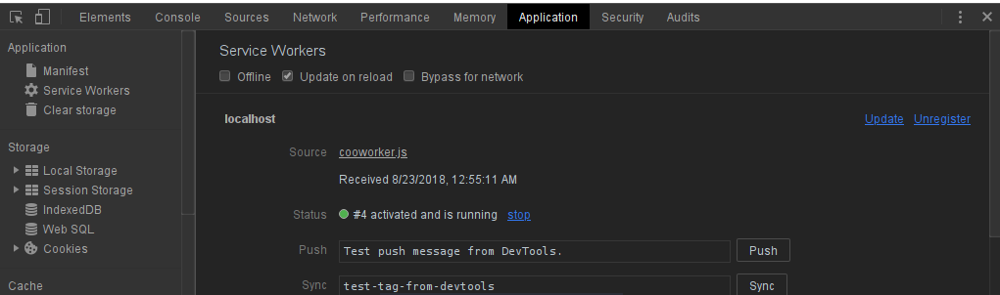

# Service worker and caching 

a simple experiment of the caching service in offline mode

# procedure 

1 - launch npm (hope you already have node pre-installed)

```bash 

npm install

```

2 - to run parcel server 

``` bash

npm run parcel::server

```

**default Browser used   : chrome or chromium** 

* go on :*localhost:1234*

* open the console Ctrl+Shift+i 



#### love Pull request 
--- 


